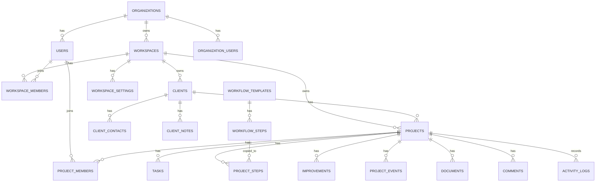

# Database

## Version

Database design v1.0.

## Design Policy

主要テーブルは Organization および Workspace でデータ分離します。

Phase 1では、必要以上に抽象化しすぎず、Project中心で実装します。

将来 Client や Workspace へ展開する可能性がある箇所は、命名と責務を整理し、Laravelのポリモーフィック関連へ移行しやすい設計にします。

## Core Tables

| Table | Role |
| --- | --- |
| organizations | 契約・全体管理・将来のSaaS課金単位 |
| workspaces | 独立した事業・顧客・案件管理の単位 |
| users | ログインユーザー。社内メンバー、パートナー、お客様を含む |
| organization_users | Organizationへの所属 |
| workspace_members | Workspaceへの所属 |
| workspace_settings | Workspaceごとの設定 |
| clients | 顧客 |
| client_contacts | 顧客担当者 |
| client_notes | 顧客メモ |
| projects | 案件本体 |
| project_members | 案件参加者。社内メンバー、パートナー、お客様を含む |
| project_types | 案件種別 |
| project_statuses | 案件ステータス |
| workflow_templates | 工程テンプレート |
| workflow_steps | 工程テンプレート内のステップ |
| project_steps | 案件に適用された工程 |
| tasks | 案件タスク |
| task_comments | タスクコメント |
| improvements | 改善 |
| project_events | 業務イベント |
| documents | 業務文書・証跡・成果物 |
| comments | 共通コメント |
| tags | タグ |
| taggables | タグ紐付け |
| notifications | 通知 |
| activity_logs | 操作履歴・監査ログ |

## Phase 2 Tables

| Table | Role |
| --- | --- |
| estimates | 見積 |
| estimate_items | 見積明細 |
| contracts | 契約 |
| deliveries | 納品・作業報告・月次報告 |
| delivery_items | 納品明細 |
| invoices | 請求 |
| invoice_items | 請求明細 |
| payments | 入金 |
| maintenance_contracts | 保守契約 |
| maintenance_items | 保守対象 |
| maintenance_events | 保守イベント |

## ER Overview



## Main Columns

### projects

```txt
id
public_id
organization_id
owning_workspace_id
billing_workspace_id
client_id
project_type_id
name
code
summary
status
priority
owner_user_id
start_date
due_date
published_at
completed_at
deleted_at
created_at
updated_at
```

### project_members

```txt
id
project_id
user_id
workspace_id
project_role
permission_level
invited_by
invited_at
accepted_at
status
created_at
updated_at
```

Project role values:

```txt
owner
project_manager
designer
coder
reviewer
mentor
client
viewer
```

Permission level values:

```txt
admin
edit
comment
view
```

### improvements

Phase 1ではProject紐付けを基本にします。

```txt
id
public_id
organization_id
workspace_id
project_id
title
current_state
desired_state
problem
hypothesis
action
result
impact
next_action
status
visibility
proposed_by
assigned_to
implemented_by
implemented_at
deleted_at
created_at
updated_at
```

将来 Client や Workspace に展開する段階で、Laravelのポリモーフィック関連を検討します。

```txt
improvable_type
improvable_id
```

ポリモーフィック関連を採用する場合、`project_id`、`client_id`、`target_type`、`target_id` のような重複カラムは原則持たせません。

### documents

Phase 1ではProject紐付けを基本にし、ファイル情報も `documents` に持たせます。

```txt
id
public_id
organization_id
workspace_id
project_id
document_type
visibility
title
description
file_name
file_path
mime_type
file_size
uploaded_by
deleted_at
created_at
updated_at
```

将来的には以下に分離できる設計を考慮します。

```txt
documents
  文書の意味、タイトル、分類、説明

document_versions
  バージョン番号、更新理由、作成者

document_files
  実ファイル、ファイル名、パス、MIMEタイプ、サイズ
```

Client や Workspace に直接紐付ける段階では、Laravelのポリモーフィック関連を検討します。

```txt
documentable_type
documentable_id
```

### comments

```txt
id
public_id
organization_id
workspace_id
project_id
commentable_type
commentable_id
body
visibility
created_by
deleted_at
created_at
updated_at
```

## Visibility Policy

Comments、Documents、Improvements は公開範囲を持ちます。

```txt
visibility
  internal
  project
  client
```

`internal` は社内限定です。

`project` はProject参加メンバー向けです。

`client` はClient roleのメンバーにも公開されます。

Client roleには、原価、利益、社内メモ、担当者評価、社内改善、内部タスク、内部コメントを表示しません。

## SaaS and Security Policy

- public_id として UUID または ULID を使用する。
- 主要テーブルに soft delete を採用する。
- 権限チェックはサーバー側で行う。
- Organization / Workspace によるテナント分離を徹底する。
- Activity Logs を監査ログとして残す。
- Workspaceごとの設定を保持する。
- Client roleの表示範囲は必ずサーバー側で制御する。

## Future Consideration: Improvement Outputs and Project Lineage

運用上、Improvement は Task だけでなく New Project、Document、Decision の起点にもなります。

Phase 2-2 では、Task / Project を Improvement から生まれる Output として実装します。Document / Knowledge / Event などは将来拡張として扱います。

### Option A: Simple Project Lineage Columns

```txt
projects
  parent_project_id nullable
  source_improvement_id nullable
```

用途:

- `parent_project_id`: どのProjectから派生したか
- `source_improvement_id`: どのImprovementから生まれたか

この方式はシンプルで、New Project の由来を追いやすいです。

### Implemented in Phase 2-2: Improvement Outputs Table

```txt
improvement_outputs
  id
  improvement_id
  output_type
  output_id
  created_by
  created_at
  updated_at
```

`output_type` の候補:

```txt
task
project
document
knowledge
event
decision
```

この方式は、Improvement から複数種類の成果物が生まれる場合に強いです。

### Tasks

Task には通常タスクと Improvement 由来タスクがあります。Phase 2-2 では `tasks.improvement_id` を nullable として実装します。

```txt
tasks
  project_id
  improvement_id nullable
```

意味:

- `improvement_id = null`: 通常タスク
- `improvement_idあり`: Improvementを実現するためのTask

### AI and Knowledge Search

AIが活用しやすい構造にするためには、成果物そのものだけでなく「なぜ生まれたか」を追えることが重要です。

`source_improvement_id` や `improvement_outputs` により、以下の流れを辿れるようにします。

```txt
Project
  ↓
Improvement
  ↓
Task / New Project / Document / Decision
  ↓
Result / Impact / Next Action
```

この構造により、将来的に以下が可能になります。

- 類似改善の検索
- 過去Projectからの改善提案
- 新Projectが生まれた背景の説明
- 成果につながった改善パターンの分析
- AIによる次の改善候補の提示

Phase 2-2 では Task / Project の Output 生成までを実装し、Document / Knowledge / Event などは運用実績を見ながら追加判断します。
